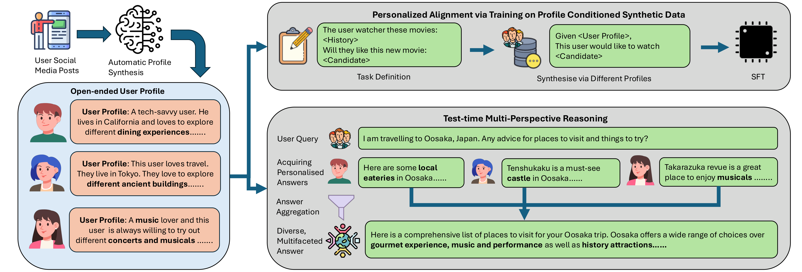

# Behaviorally Grounded User Profiles from the Wild

Code for the paper **"Behaviorally Grounded User Profiles from the Wild for Personalized Alignment and
Multi-Perspective Reasoning."**

We introduce **profile behavioral grounding**: a framework that extracts open-ended, high-fidelity user profiles
directly from authentic, anonymized social-media activity, and uses them to personalize language models. Unlike
rigid synthetic personas built from a few categorical attributes, these behavior-derived profiles capture the
nuanced, idiosyncratic signals that drive real preferences. We study them under two paradigms:

- **Train-time personalization** — profile-conditioned synthetic data for supervised fine-tuning (SFT) on
  recommendation and open-ended QA.
- **Test-time multi-perspective reasoning** — a non-parametric approach that samples semantically relevant profiles
  as candidate "experts" and aggregates their viewpoints into a single multifaceted answer.




*Our framework for user profile synthesis and utilization. We extract open-ended user profiles from user behaviour
sequences (e.g. social-media posts). With these diverse, realistic profiles we synthesize SFT data to parametrically
align models for personalization tasks, and additionally study test-time multi-perspective reasoning.*

## Repository layout

```
conf/                     Hydra configuration
  config.yaml             top-level defaults
  model/                  model configs (Qwen3 8B/14B/32B, Gemma3 4B, Olmo3 7B, GPT-OSS 20B/120B, Qwen3 embedding)
  inference/              inference backends (vLLM, Transformers, OpenRouter)
  task/
    persona/              profile extraction (single/multi-tweet, dedupe/summarize)
    data/                 profile-conditioned SFT data synthesis + synthetic-baseline generation
    finetuning/           supervised fine-tuning
    evaluate/             URS scoring, finetuned-persona evaluation, persona prediction, profile QA
    test_time/            multi-perspective sampling, aggregation, scoring
pipeline/                 implementation for each task category (entry points referenced by the configs)
main.py                   Hydra entry point
env.yaml                  conda environment
```

## Setup

```bash
conda env create -f env.yaml
conda activate behavior_grounding
```

Requires Python 3.11 and CUDA-capable GPUs for training/inference.

### Environment variables

Configs reference these paths via environment variables (no absolute paths are hardcoded):

| Variable     | Meaning                                                          |
| ------------ | ---------------------------------------------------------------- |
| `PWD`        | Project root (set automatically to the current directory)        |
| `MODEL_ROOT` | Directory containing local model weights                         |
| `DATA_ROOT`  | Directory containing external datasets (see below)               |

```bash
export MODEL_ROOT=/path/to/models
export DATA_ROOT=/path/to/datasets
```

### External datasets

These are not redistributed here; obtain them from their original sources and place them under `$DATA_ROOT`:

- **2 Million Bluesky Posts** (Dale, 2024, Apache 2.0) — raw posts for profile extraction.
- **RecBench** — pairwise recommendation evaluation.
- **URS Bench** — multi-intent user-query benchmark.

The extracted user profiles used throughout are released as a dataset (see [Data](#data)); place the CSVs under
`persistent_data/user_profile/` or point the relevant configs at them.

## Usage

The project uses [Hydra](https://hydra.cc/). Run any task with:

```bash
python main.py task=<CATEGORY>/<TASK> model=<MODEL> [overrides...]
```

Examples:

```bash
# 1. Extract open-ended profiles from social-media posts
python main.py task=persona/social_media_twitter_persona model=gptoss120b
python main.py task=persona/social_media_twitter_dedupe   model=gptoss120b

# 2. Synthesize profile-conditioned SFT data
python main.py task=data/recommendation_recbench_interest model=gptoss120b
python main.py task=data/urs_personalised_data            model=gptoss120b

# 3. Fine-tune a model on the synthetic data
python main.py task=finetuning/sft_v2 model=qwen3_8b

# 4. Evaluate
python main.py task=evaluate/urs_persona            model=qwen3_8b
python main.py task=evaluate/twitter_persona_predict model=qwen3_8b

# 5. Test-time multi-perspective reasoning
python main.py task=test_time/test_time_urs_related_persona model=qwen3_8b
python main.py task=test_time/test_time_urs_summary         model=gptoss120b
```

Override any config value on the command line, e.g.
`python main.py task=finetuning/sft_v2 model=qwen3_8b training.learning_rate=2e-5`.

Outputs default to `outputs/<package>/<task>/<model>/`. Experiment tracking via Weights & Biases is configured in
`conf/config.yaml`.

## Results

Downstream results for the Qwen3 models, comparing **No Profile** (base model), the **Synthetic** baseline, and our
**Open-Ended** behaviorally grounded profiles. RecBench columns (Netflix, Books, News) report F1; URS columns
(Leisure, Creativity, Advice, Avg.) report the 1–10 LLM-judge score. Higher is better; **bold** = best per column
within each model.

| Model | Variant | Netflix (F1) | Books (F1) | News (F1) | Leisure | Creativity | Advice | Avg. |
| --- | --- | --- | --- | --- | --- | --- | --- | --- |
| Qwen3-8B  | No Profile | 0.421 | 0.515 | 0.318 | 5.48 | 5.31 | 5.99 | 5.59 |
|           | Synthetic  | 0.420 | 0.625 | 0.319 | 6.34 | 6.72 | 7.08 | 6.72 |
|           | Open-Ended | **0.450** | **0.649** | **0.322** | **6.76** | **7.40** | **7.65** | **7.27** |
| Qwen3-14B | No Profile | 0.419 | 0.308 | 0.303 | **7.49** | 7.90 | 8.06 | 7.82 |
|           | Synthetic  | 0.416 | 0.538 | **0.327** | 7.06 | 7.54 | 7.91 | 7.50 |
|           | Open-Ended | **0.459** | **0.632** | 0.321 | 7.29 | **8.10** | **8.27** | **7.88** |
| Qwen3-32B | No Profile | 0.403 | 0.569 | 0.308 | 6.79 | 7.09 | 6.90 | 6.93 |
|           | Synthetic  | 0.427 | 0.580 | **0.317** | 7.20 | 7.87 | 8.06 | 7.71 |
|           | Open-Ended | **0.455** | **0.658** | 0.315 | **7.35** | **8.06** | **8.23** | **7.88** |


## Data

The anonymized user profiles are released as a companion dataset:

- `open_ended_profiles.csv` — 824 behaviorally grounded profiles extracted from real Bluesky histories.
- `synthetic_baseline_profiles.csv` — 842 purely synthetic baseline profiles.

Both are pseudonymized and scrubbed of handles, contact details, and URLs. See the dataset card for schema,
provenance, and ethical considerations.

## License

Released under the **Apache License 2.0** (see `LICENSE`), consistent with the source Bluesky corpus.

## Citation

```bibtex
@inproceedings{behaviorally_grounded_profiles,
  title     = {Behaviorally Grounded User Profiles from the Wild for Personalized Alignment and Multi-Perspective Reasoning},
  author    = {PLACEHOLDER},
  booktitle = {PLACEHOLDER},
  year      = {2026}
}
```
